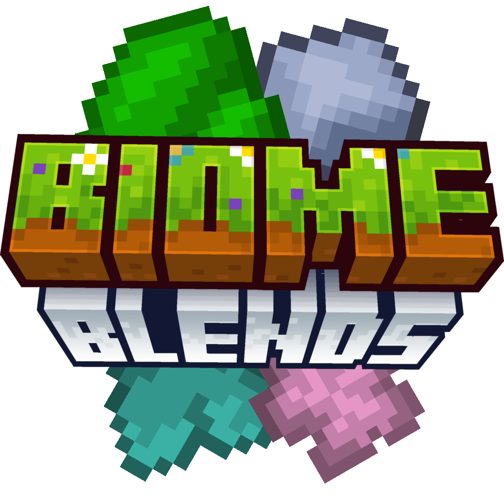

  

# Biome Blends

Biome Blends is a Minecraft mod created to make biome changes possible in survival. It offers extensive data pack support, making it really easy to add custom blends with different actions, effects and conditions.

# Wiki

Information about mod customization can be found [on the wiki](https://moddedmc.wiki/en/project/biome-blends/latest/docs).